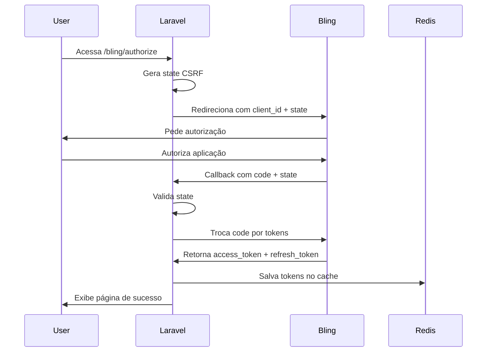

# 🔌 Integração Bling ERP - Guia Completo

## 📋 Sumário

1. [Painel Administrativo](#painel-administrativo)
2. [Autenticação OAuth2](#autenticação-oauth2)
3. [Comandos Artisan](#comandos-artisan)
4. [API Endpoints](#api-endpoints)
5. [Sincronização de Dados](#sincronização-de-dados)
6. [Webhooks](#webhooks)
7. [Próximos Passos](#próximos-passos)

---

## 🎛️ Painel Administrativo

### Acessar o Painel

```
http://localhost:8000/bling
```

O painel oferece interface visual para:

- ✅ **Status da conexão** com Bling em tempo real
- ✅ **Autorização OAuth2** com um clique
- ✅ **Listar produtos** do catálogo Bling
- ⏳ **Sincronizar estoques** (em desenvolvimento)
- ⏳ **Gerenciar pedidos** (em desenvolvimento)
- ⏳ **Sincronizar clientes** (em desenvolvimento)
- ⏳ **Emitir NF-e** (em desenvolvimento)
- ⏳ **Configurar webhooks** (em desenvolvimento)

### Funcionalidades Disponíveis

#### ✅ Autorizar Bling
1. Clique no botão **"Autorizar Bling"**
2. Será redirecionado para a página de autorização do Bling
3. Faça login e autorize o aplicativo
4. Será redirecionado de volta com tokens salvos automaticamente

#### ✅ Listar Produtos
1. Certifique-se de estar autenticado
2. Clique em **"Listar Produtos"** no card de Produtos
3. O console integrado mostrará os produtos do Bling

#### ✅ Desconectar
1. Clique no botão **"Desconectar"**
2. Confirme a ação
3. Os tokens serão removidos do cache

---

## 🔐 Autenticação OAuth2

### Fluxo de Autorização



### Rotas OAuth

| Rota | Método | Descrição |
|------|--------|-----------|
| `/bling/authorize` | GET | Inicia fluxo OAuth (redireciona para Bling) |
| `/bling/callback` | GET | Recebe callback do Bling e troca code por tokens |
| `/bling/status` | GET | Verifica status da autenticação (JSON) |
| `/bling/revoke` | POST | Revoga tokens (desconecta) |

### Configuração (.env)

```env
BLING_CLIENT_ID=2caae5906bd4a52d8f24fdb6878f4c5bd7cdddcc
BLING_CLIENT_SECRET=58889e54ab2725194eda01ea2880fa6132b03b51c1277be1b9d1f66711ff
BLING_BASE_URL=https://api.bling.com.br/Api/v3
BLING_DEFAULT_WAREHOUSE_ID=1
BLING_REDIRECT_URI=http://localhost:8000/bling/callback
```

⚠️ **Importante**: Em produção, altere `BLING_REDIRECT_URI` para `https://rodust.com.br/bling/callback`

### Armazenamento de Tokens

Os tokens são salvos no **Redis** (cache):

```php
// Access Token (expira em 6 horas)
Cache::put('bling_access_token', $token, now()->addSeconds(21600));

// Refresh Token (expira em 30 dias)
Cache::put('bling_refresh_token', $refreshToken, now()->addDays(30));
```

### Renovação Automática

O `BlingV3Adapter` renova automaticamente o access token quando expirado:

```php
protected function getAccessToken(): string
{
    if ($this->accessToken && !$this->isTokenExpired()) {
        return $this->accessToken;
    }

    if ($this->refreshToken) {
        return $this->refreshAccessToken();
    }

    throw new \RuntimeException('No valid access token available. Please authenticate first.');
}
```

---

## 🛠️ Comandos Artisan

### Listar Produtos

```bash
docker exec ecommerce-laravel.test-1 php artisan bling:list-products --limit=10
```

**Saída esperada:**
```
📦 Buscando produtos do Bling...

✅ 10 produtos encontrados:

┌─────────┬──────────┬──────────────────────┬───────────┬─────────┐
│ ID Bling│ SKU      │ Nome                 │ Preço     │ Estoque │
├─────────┼──────────┼──────────────────────┼───────────┼─────────┤
│ 123456  │ PROD-001 │ Produto Exemplo      │ R$ 99,90  │ 50      │
└─────────┴──────────┴──────────────────────┴───────────┴─────────┘
```

### Validar Conexão

```bash
docker exec ecommerce-laravel.test-1 php artisan bling:validate
```

**Saída esperada:**
```
🚀 Iniciando validação Bling API v3...

📥 Passo 1: Obtendo dados do produto...
✅ Produto obtido: Produto Teste (ID: 123456)

📤 Passo 2: Criando produto no Bling...
✅ Produto criado com sucesso! ID: 789012

🗑️  Passo 3: Deletando produto de teste...
✅ Produto deletado com sucesso!

✅ Validação completa! Bling API v3 está funcionando.
```

### Obter Token Manualmente

```bash
# Se você tiver um authorization code
docker exec ecommerce-laravel.test-1 php artisan bling:get-token {code}
```

---

## 🌐 API Endpoints

### GET /bling/api/products

Lista produtos do Bling via API.

**Parâmetros:**
- `limit` (opcional, padrão: 10) - Número de produtos a retornar

**Exemplo:**
```bash
curl http://localhost:8000/bling/api/products?limit=5
```

**Resposta:**
```json
{
  "success": true,
  "data": [
    {
      "id": 123456,
      "nome": "Produto Exemplo",
      "codigo": "PROD-001",
      "preco": 99.90,
      "estoque": {
        "saldo": 50
      }
    }
  ]
}
```

---

## 🔄 Sincronização de Dados

### Produtos

#### Importar do Bling para Laravel

```bash
# Em desenvolvimento - comando futuro
docker exec ecommerce-laravel.test-1 php artisan bling:sync-products
```

**Fluxo:**
1. Busca todos os produtos da API Bling
2. Para cada produto:
   - Verifica se já existe no Laravel (por `bling_id`)
   - Se não existe: cria registro
   - Se existe: atualiza dados (preço, estoque, nome)
3. Atualiza campo `last_bling_sync`

#### Enviar do Laravel para Bling

```bash
# Em desenvolvimento - comando futuro
docker exec ecommerce-laravel.test-1 php artisan bling:push-products
```

### Estoques

#### Atualização em Tempo Real (Webhook)

Quando um produto é vendido no Bling, o webhook atualiza automaticamente:

```php
// WebhookController@handle
if ($topic === 'estoques') {
    $product = Product::where('bling_id', $blingId)->first();
    if ($product) {
        $product->update(['stock' => $newStock]);
    }
}
```

### Clientes

#### Sincronizar após Email Confirmado

**Objetivo:** Quando um cliente confirma o email, criar automaticamente no Bling.

**Status:** ⏳ Em desenvolvimento (tarefa no TODO)

**Implementação prevista:**

```php
// app/Services/BlingCustomerSync.php
class BlingCustomerSync
{
    public function syncToBling(Customer $customer)
    {
        $erp = app(ERPInterface::class);
        
        $blingId = $erp->createCustomer([
            'name' => $customer->name,
            'email' => $customer->email,
            'phone' => $customer->phone,
            'document' => $customer->cpf_cnpj,
            'type' => 'Cliente Ecommerce'
        ]);
        
        $customer->update(['bling_id' => $blingId]);
    }
}

// app/Jobs/SyncCustomerToBling.php
class SyncCustomerToBling implements ShouldQueue
{
    public function handle(BlingCustomerSync $sync)
    {
        $sync->syncToBling($this->customer);
    }
}
```

### Pedidos

#### Enviar Pedido para Bling

**Objetivo:** Ao finalizar checkout, criar pedido no Bling automaticamente.

**Fluxo previsto:**
1. Cliente finaliza compra no WordPress
2. Laravel cria registro em `orders` e `order_items`
3. Job assíncrono envia para Bling
4. Bling retorna ID do pedido
5. Laravel salva `bling_id` na tabela `orders`

---

## 🪝 Webhooks

### Configurar Webhooks no Bling

1. Acesse [Bling Developer Dashboard](https://developer.bling.com.br/)
2. Vá em "Minhas Aplicações" → sua aplicação
3. Configure a URL de webhook:
   - **Local (desenvolvimento):** `http://localhost:8000/api/webhooks/bling`
   - **Produção:** `https://rodust.com.br/api/webhooks/bling`
4. Selecione os eventos:
   - ✅ `produtos` - Produto criado/atualizado/deletado
   - ✅ `estoques` - Estoque alterado
   - ✅ `pedidos` - Pedido criado/mudança de status
   - ✅ `notasfiscais` - NF-e/NFC-e emitida

### Endpoint de Webhook

**Rota:** `POST /api/webhooks/bling`

**Handler:** `App\Http\Controllers\Api\WebhookController@handle`

**Eventos Suportados:**

| Evento | Ação |
|--------|------|
| `produtos.created` | Cria produto no Laravel |
| `produtos.updated` | Atualiza dados do produto |
| `produtos.deleted` | Soft delete do produto |
| `estoques.updated` | Atualiza campo `stock` |
| `pedidos.updated` | Atualiza status do pedido |
| `notasfiscais.issued` | Salva dados da NF-e |

**Exemplo de Payload:**

```json
{
  "topic": "produtos",
  "action": "updated",
  "data": {
    "id": 123456,
    "nome": "Produto Atualizado",
    "preco": 149.90,
    "estoque": {
      "saldo": 30
    }
  }
}
```

### Logs de Webhook

Todos os webhooks são logados:

```php
Log::info('Bling Webhook received', [
    'topic' => $topic,
    'action' => $action,
    'data' => $data
]);
```

Verificar logs:
```bash
docker exec ecommerce-laravel.test-1 tail -f storage/logs/laravel.log
```

---

## 📝 Próximos Passos

### 🔴 Prioridade Alta

#### 1. Sincronização de Produtos
- [ ] Comando `bling:sync-products` para importar catálogo completo
- [ ] Job assíncrono para não travar (milhares de produtos)
- [ ] Progress bar e logs detalhados
- [ ] Tratar imagens (baixar do Bling e salvar no WordPress)

#### 2. Service BlingCustomerSync
- [ ] Criar `app/Services/BlingCustomerSync.php`
- [ ] Método `syncToBling(Customer $customer)`
- [ ] Definir tipo como "Cliente Ecommerce"
- [ ] Salvar `bling_id` na tabela `customers`

#### 3. Job SyncCustomerToBling
- [ ] Criar `app/Jobs/SyncCustomerToBling.php`
- [ ] Implementar `ShouldQueue`
- [ ] Disparar no evento `EmailVerified`
- [ ] Retry com backoff exponencial

### 🟡 Prioridade Média

#### 4. Sincronização de Pedidos
- [ ] Job `SyncOrderToBling` (disparar após checkout)
- [ ] Incluir itens do pedido
- [ ] Incluir dados do cliente
- [ ] Incluir endereço de entrega
- [ ] Incluir método de pagamento

#### 5. Atualização de Status
- [ ] Webhook `pedidos.updated` → atualizar status no Laravel
- [ ] Notificar cliente por email quando status mudar
- [ ] Adicionar código de rastreio quando enviado

#### 6. Notas Fiscais
- [ ] Salvar dados da NF-e no banco (número, chave, XML)
- [ ] Disponibilizar download da NF-e para cliente
- [ ] Link "Baixar NF-e" na página do pedido

### 🟢 Prioridade Baixa

#### 7. Painel de Estatísticas
- [ ] Dashboard com métricas do Bling
- [ ] Produtos mais vendidos
- [ ] Estoque baixo (alertas)
- [ ] Valor total de pedidos do mês
- [ ] Gráficos (Chart.js ou ApexCharts)

#### 8. Gestão de Estoque
- [ ] Alertas de estoque baixo
- [ ] Reserva de estoque durante checkout
- [ ] Liberação automática se pedido expirar

#### 9. Automações
- [ ] Sincronização automática diária (cron)
- [ ] Backup de produtos semanalmente
- [ ] Relatórios automáticos por email

---

## 🔧 Troubleshooting

### Token Expirado

**Sintoma:** Erro 401 "Invalid token"

**Solução:**
1. Acesse `http://localhost:8000/bling`
2. Clique em "Autorizar Bling" novamente
3. Ou rode: `docker exec ecommerce-laravel.test-1 php artisan bling:get-token {code}`

### Webhook Não Chega

**Possíveis causas:**
1. **URL inválida:** Bling não consegue acessar `localhost`. Use ngrok para expor:
   ```bash
   ngrok http 8000
   # Configure no Bling: https://abc123.ngrok.io/api/webhooks/bling
   ```
2. **Eventos não selecionados** no painel do Bling
3. **Firewall bloqueando** requisições do Bling

### Cache de Tokens

Se mudou `CACHE_STORE` de `database` para `redis`:

```bash
docker exec ecommerce-laravel.test-1 php artisan cache:clear
```

Depois reautorize pelo painel.

---

## 📚 Recursos

- **Bling API v3 Docs:** https://developer.bling.com.br/aplicativos
- **Bling Developer Portal:** https://developer.bling.com.br/
- **Painel Administrativo:** http://localhost:8000/bling
- **Status da Conexão:** http://localhost:8000/bling/status

---

**Última atualização:** Novembro 2025
