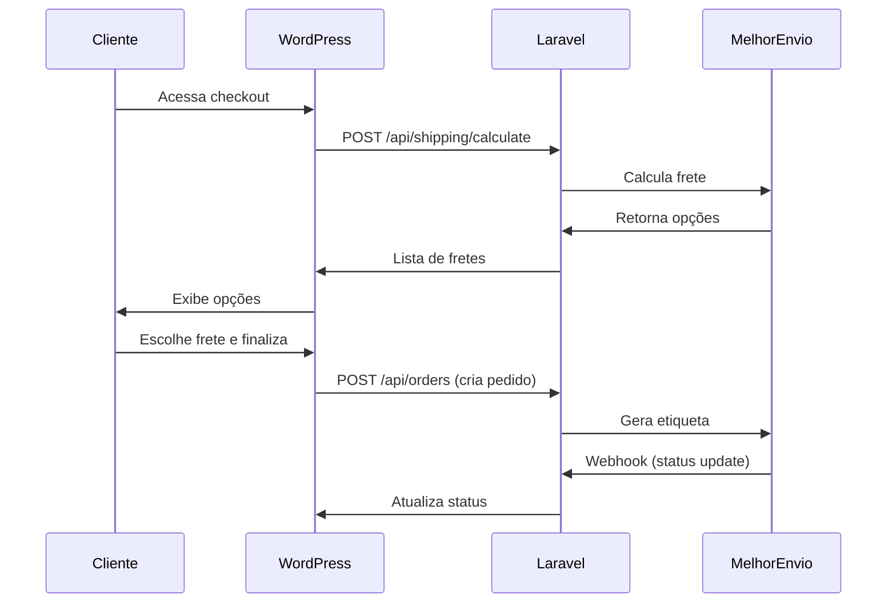

# Integração Melhor Envio

Documentação completa da integração com a API do Melhor Envio para cálculo de frete, geração de etiquetas e rastreamento.

## 📋 Índice

- [Configuração Inicial](#configuração-inicial)
- [Desenvolvimento com ngrok](#desenvolvimento-com-ngrok)
- [URLs de Produção](#urls-de-produção)
- [Autenticação OAuth](#autenticação-oauth)
- [Endpoints Disponíveis](#endpoints-disponíveis)
- [Testando a Integração](#testando-a-integração)

---

## 🔧 Configuração Inicial

### 1. Criar conta no Melhor Envio

**Ambiente de Testes (Sandbox):**
- Acesse: https://sandbox.melhorenvio.com.br/cadastre-se
- Crie sua conta de testes
- Acesse: https://sandbox.melhorenvio.com.br/painel/gerenciar/tokens
- Clique em **"Criar Token"** → **"Token de Acesso"**
- Copie o **Bearer Token** gerado

**Ambiente de Produção:**
- Acesse: https://melhorenvio.com.br/cadastre-se
- Configure sua conta real
- Acesse: https://melhorenvio.com.br/painel/gerenciar/tokens

### 2. Configurar credenciais no Laravel

**MÉTODO RECOMENDADO: Bearer Token (Mais Simples)**

Execute o comando artisan e escolha "Bearer Token":

```bash
docker compose exec laravel.test php artisan melhorenvio:setup

# Ou diretamente:
docker compose exec laravel.test php artisan melhorenvio:setup \
  --bearer-token=SEU_BEARER_TOKEN_AQUI \
  --cep=13400710 \
  --sandbox
```

**MÉTODO ALTERNATIVO: OAuth2 (Mais Complexo)**

Se preferir usar OAuth2 com Client ID + Secret:

```bash
docker compose exec laravel.test php artisan melhorenvio:setup \
  --client-id=SEU_CLIENT_ID \
  --client-secret=SEU_CLIENT_SECRET \
  --cep=13400710 \
  --sandbox
```

**Parâmetros:**
- `--bearer-token`: Token de acesso direto (RECOMENDADO)
- `--client-id`: Client ID do OAuth2 (alternativo)
- `--client-secret`: Client Secret do OAuth2 (alternativo)
- `--cep`: CEP de origem (onde os produtos serão enviados) - apenas números
- `--sandbox`: (Opcional) Usar ambiente de testes

> **📌 Bearer Token Sandbox Salvo:**
> ```
> eyJ0eXAiOiJKV1QiLCJhbGciOiJSUzI1NiJ9.eyJhdWQiOiI5NTYiLCJqdGkiOiJhNjE1YjczMDA1ZWM3NjY4N2ZjZDcwYWIxNzNjMDM2MGQ5ZjYyZjBlMDE5NGVjZGEyNjY4NGNhMmVhNDY3NjNjMTA5NWU3ZWRhNDQ4MjU3ZiIsImlhdCI6MTc2NDE2NDEwNC45MTg2ODcsIm5iZiI6MTc2NDE2NDEwNC45MTg2OSwiZXhwIjoxNzk1NzAwMTA0LjkxMDU3Niwic3ViIjoiOWM1ZjkwYzktNTg1My00MzYxLTk1MGQtMDBjOWE0MTE1YmFmIiwic2NvcGVzIjpbImNhcnQtcmVhZCIsImNhcnQtd3JpdGUiLCJjb21wYW5pZXMtcmVhZCIsImNvbXBhbmllcy13cml0ZSIsImNvdXBvbnMtcmVhZCIsImNvdXBvbnMtd3JpdGUiLCJub3RpZmljYXRpb25zLXJlYWQiLCJvcmRlcnMtcmVhZCIsInByb2R1Y3RzLXJlYWQiLCJwcm9kdWN0cy1kZXN0cm95IiwicHJvZHVjdHMtd3JpdGUiLCJwdXJjaGFzZXMtcmVhZCIsInNoaXBwaW5nLWNhbGN1bGF0ZSIsInNoaXBwaW5nLWNhbmNlbCIsInNoaXBwaW5nLWNoZWNrb3V0Iiwic2hpcHBpbmctY29tcGFuaWVzIiwic2hpcHBpbmctZ2VuZXJhdGUiLCJzaGlwcGluZy1wcmV2aWV3Iiwic2hpcHBpbmctcHJpbnQiLCJzaGlwcGluZy1zaGFyZSIsInNoaXBwaW5nLXRyYWNraW5nIiwiZWNvbW1lcmNlLXNoaXBwaW5nIiwidHJhbnNhY3Rpb25zLXJlYWQiLCJ1c2Vycy1yZWFkIiwidXNlcnMtd3JpdGUiLCJ3ZWJob29rcy1yZWFkIiwid2ViaG9va3Mtd3JpdGUiLCJ3ZWJob29rcy1kZWxldGUiLCJ0ZGVhbGVyLXdlYmhvb2siXX0.jAqEporV1dkASFty7HGvep9w-AFOTiE5kChTPBruWY6gl-NXM4V7bkE_H6KKSjJqgN-vyg-FoK-J8294hR2-FKMh4y0rOdvGY7zyaa4DSUjJsa5hUB7NlNWJTbJPsAGItJzkTOW47VyYb8LX6qlmUC_enqfyk2h1qSUJnmi0YGbHRp-hwUn7UI5Pzu8ik6P73MC3Sdc9VVZtoO6Czx4Go0dwDnCDOgFtK6SQGuvILxaABv8MxbfwHbBsd9GzLhbjM0tIL3QXo0Ky2aS1JO0DFhGVxyUwNq-ItEkE1PKXzAW9Sjef1YrQGXjh43TRjBvRNOh7BYiyY35uZ6dB2qQjfziClW-yFhb8cN3xh0xxOjpgKNV32m2IthBJdMbC9wRFryKNSVEB5URMddxmlUdEOFR3ETW9fWQNDgSsEb0DNtVSxzfS1kBEYfcPhrk7HCwLOKcS7anUXQQpTHZ1Tq4ekEnk-xoXfdnkKNfsc2veI6p-9xQ8TfPrGu-Nj2BNHfZhd-OAnAa92zgmnv8WxmQnX8g1-EFkEntBxub8l396J5tBwhpvYI-aqSmI25NwHMk7rLrRmiQxNl4CPYv4sl93w9qPc2fcW0DwQlrkQ0sbh94yfwI4B0hJ1y6htsV7CqYRmS1ZYEIoKNE09UJH3tFxPk5NzlbTP_qZUBXGY1ib30o
> ```
> Expira em: 2056 (válido por ~30 anos)

---

## 🚀 Desenvolvimento com ngrok

O Melhor Envio exige URLs públicas com HTTPS. Para desenvolvimento local, use o **ngrok**.

### Instalar ngrok

1. **Download**: https://ngrok.com/download
2. **Criar conta** (gratuita): https://dashboard.ngrok.com/signup
3. **Obter authtoken**: https://dashboard.ngrok.com/get-started/your-authtoken

### Configurar ngrok

```powershell
# Configurar token (fazer uma vez apenas)
ngrok config add-authtoken SEU_TOKEN_AQUI
```

### Executar ngrok

```powershell
# Criar túnel para a porta 8000 (Laravel)
ngrok http 8000
```

O ngrok vai exibir uma URL pública tipo:
```
Forwarding  https://abc123def456.ngrok-free.app -> http://localhost:8000
```

### URLs para configurar no Melhor Envio (Desenvolvimento)

Copie a URL do ngrok (exemplo: `https://abc123def456.ngrok-free.app`) e configure no painel do Melhor Envio:

**URL de Redirecionamento OAuth:**
```
https://abc123def456.ngrok-free.app/api/melhor-envio/oauth/callback
```

**URL de Webhook:**
```
https://abc123def456.ngrok-free.app/api/melhor-envio/webhook
```

> ⚠️ **Importante**: Sempre que reiniciar o ngrok, a URL muda! Você precisa atualizar no painel do Melhor Envio.

---

## 🌐 URLs de Produção

Quando subir para produção (servidor real), use as URLs diretas do seu domínio.

**Exemplo para domínio: rodust.com.br**

**URL de Redirecionamento OAuth:**
```
https://api.rodust.com.br/api/melhor-envio/oauth/callback
```

**URL de Webhook:**
```
https://api.rodust.com.br/api/melhor-envio/webhook
```

> 💡 **Dica**: Substitua `api.rodust.com.br` pelo domínio/subdomínio onde o Laravel estará hospedado.

---

## 🔐 Autenticação OAuth

### 1. Configurar URLs no Melhor Envio

Acesse o painel do Melhor Envio e configure as URLs (desenvolvimento ou produção):

**Sandbox:** https://sandbox.melhorenvio.com.br/painel/gerenciar/tokens  
**Produção:** https://melhorenvio.com.br/painel/gerenciar/tokens

1. Clique em **"Meus aplicativos"**
2. Edite seu aplicativo
3. Configure:
   - **URL de Redirecionamento**: Cole a URL do OAuth callback
   - **URL de Webhook**: Cole a URL do webhook
4. Salve

### 2. Obter URL de autorização

Faça uma requisição GET para obter a URL de autorização:

```bash
# Precisa estar autenticado como admin
curl -X GET http://localhost:8000/api/admin/melhor-envio/auth \
  -H "Authorization: Bearer SEU_TOKEN_ADMIN"
```

**Resposta:**
```json
{
  "success": true,
  "auth_url": "https://sandbox.melhorenvio.com.br/oauth/authorize?client_id=..."
}
```

### 3. Autorizar no navegador

1. Copie a `auth_url` e cole no navegador
2. Faça login no Melhor Envio (se necessário)
3. Clique em **"Autorizar"**
4. Você será redirecionado de volta e o token será salvo automaticamente

### 4. Verificar autenticação

```bash
curl -X GET http://localhost:8000/api/admin/melhor-envio/settings \
  -H "Authorization: Bearer SEU_TOKEN_ADMIN"
```

**Resposta:**
```json
{
  "success": true,
  "data": {
    "sandbox_mode": true,
    "origin_postal_code": "13400710",
    "is_authenticated": true,
    "token_expires_at": "2025-12-26T15:30:00.000000Z"
  }
}
```

---

## 📡 Endpoints Disponíveis

### Cálculo de Frete (Público)

**Endpoint:** `POST /api/shipping/calculate`

**Body:**
```json
{
  "postal_code": "13400710",
  "products": [
    {
      "quantity": 2,
      "weight": 0.5,
      "height": 10,
      "width": 15,
      "length": 20
    }
  ]
}
```

**Resposta:**
```json
{
  "success": true,
  "data": [
    {
      "id": 1,
      "name": "PAC",
      "company": "Correios",
      "company_logo": "https://...",
      "price": 25.50,
      "discount": 0,
      "delivery_time": 5,
      "delivery_range": {
        "min": 4,
        "max": 6
      }
    },
    {
      "id": 2,
      "name": "SEDEX",
      "company": "Correios",
      "price": 45.80,
      "delivery_time": 2
    }
  ]
}
```

### Configurações (Admin)

**Obter configurações:**
```bash
GET /api/admin/melhor-envio/settings
```

**Atualizar configurações:**
```bash
POST /api/admin/melhor-envio/settings
Body: { "client_id": "...", "client_secret": "...", "sandbox_mode": true, "origin_postal_code": "13400710" }
```

### Webhook (Melhor Envio → Laravel)

**Endpoint:** `POST /api/melhor-envio/webhook`

Este endpoint recebe automaticamente as atualizações do Melhor Envio quando:
- Uma etiqueta é gerada
- Um pedido é postado
- Um pedido é entregue
- Um pedido é cancelado

---

## 🧪 Testando a Integração

### 1. Verificar configurações

```bash
docker compose exec laravel.test php artisan tinker
```

```php
// Verificar settings
$settings = \App\Models\MelhorEnvioSetting::first();
$settings->client_id; // Deve mostrar seu Client ID
$settings->sandbox_mode; // true para sandbox
$settings->is_authenticated; // true se já autenticou
```

### 2. Testar cálculo de frete

Use o Postman, Insomnia ou cURL:

```bash
curl -X POST http://localhost:8000/api/shipping/calculate \
  -H "Content-Type: application/json" \
  -d '{
    "postal_code": "01310100",
    "products": [
      {
        "quantity": 1,
        "weight": 0.5,
        "height": 10,
        "width": 15,
        "length": 20
      }
    ]
  }'
```

### 3. Testar no checkout

Ao acessar o checkout do e-commerce, o sistema deve:
1. Pegar o CEP do endereço de entrega do cliente
2. Chamar automaticamente `/api/shipping/calculate`
3. Exibir as opções de frete com preços e prazos
4. Permitir o cliente escolher

---

## 🔄 Fluxo Completo



---

## 📝 Comandos Úteis

```bash
# Configurar Melhor Envio
php artisan melhorenvio:setup

# Ver logs
tail -f storage/logs/laravel.log

# Limpar cache
php artisan cache:clear
php artisan config:clear

# Testar conexão com Melhor Envio
php artisan tinker
$service = new \App\Services\MelhorEnvioService();
$service->calculateShipping('01310100', [['quantity' => 1, 'weight' => 0.5]]);
```

---

## ⚠️ Troubleshooting

### Erro: "Token expired"
O token OAuth expira. O sistema renova automaticamente, mas se der erro:
```bash
# Force refresh do token
php artisan tinker
$service = new \App\Services\MelhorEnvioService();
$service->refreshToken();
```

### Erro: "CEP de origem não configurado"
```bash
php artisan melhorenvio:setup --cep=SEU_CEP --client-id=... --client-secret=...
```

### Erro: "ngrok não encontrado"
```bash
# Windows: Adicione o ngrok.exe ao PATH ou execute do diretório onde está
cd C:\caminho\onde\esta\ngrok
ngrok http 8000
```

### Webhook não está chegando
1. Verifique se a URL está correta no painel do Melhor Envio
2. Verifique os logs: `storage/logs/laravel.log`
3. Teste manualmente com cURL:
```bash
curl -X POST https://sua-url/api/melhor-envio/webhook \
  -H "Content-Type: application/json" \
  -d '{"event":"order.created","order_id":"123"}'
```

---

## 🔒 Segurança em Produção

1. **HTTPS obrigatório**: Melhor Envio só aceita URLs HTTPS
2. **Valide webhooks**: Verifique a origem das requisições
3. **Rate limiting**: Configure limites de requisições
4. **Logs**: Monitore tentativas de acesso não autorizado
5. **Tokens**: Nunca exponha tokens em logs ou front-end

---

## 📚 Referências

- **API Melhor Envio**: https://docs.melhorenvio.com.br/
- **Sandbox**: https://sandbox.melhorenvio.com.br/
- **ngrok**: https://ngrok.com/docs
- **OAuth2**: https://oauth.net/2/
